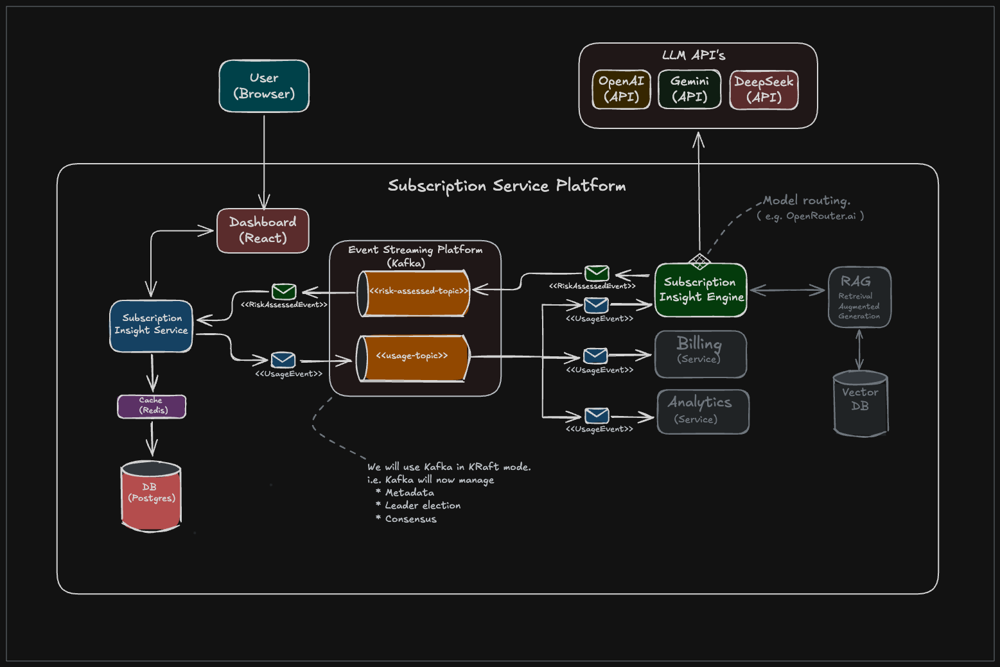

# Subscription Insight Platform

A production-style platform for analysing customer subscription behaviour 
and predicting churn risk — identifying customers likely to cancel and 
providing customer success teams with plain English risk assessments and 
actionable retention recommendations.

Built as an event-driven microservices system: a Spring Boot service manages 
customers and subscriptions, publishing usage events to Kafka when high-signal 
behaviour is detected (downgrades, payment failures, usage drops). A Python 
FastAPI engine consumes these events, assesses churn risk, and where necessary 
calls an LLM to generate a plain English explanation and recommended intervention 
— giving non-technical teams the context they need to act quickly.

## Architecture



### Services

| Service | Stack | Responsibility |
|---|---|---|
| subscription-insight-service | Spring Boot, PostgreSQL | Customer and subscription management, Kafka producer/consumer |
| subscription-insight-engine | FastAPI, Python | Risk assessment, LLM integration, Kafka producer/consumer |

### Event Flow

```
subscription-insight-service
        │
        │  publishes UsageEvent
        ▼
    Kafka (usage-topic)
        │
        │  consumes UsageEvent
        ▼
subscription-insight-engine
        │
        │  scores risk via LLM
        │  publishes RiskEvent
        ▼
    Kafka (risk-assessed-topic)
        │
        │  consumes RiskEvent
        ▼
subscription-insight-service
        │
        │  persists risk assessment
        ▼
    PostgreSQL
```

## Tech Stack

- **Spring Boot** — REST API, Kafka producer/consumer, JPA/PostgreSQL
- **FastAPI** — async Python service, Kafka consumer/producer
- **Apache Kafka** (KRaft mode) — event streaming between services
- **PostgreSQL** — persistent storage
- **OpenAI API** — LLM-powered risk scoring
- **Docker Compose** — local orchestration of all services

## Getting Started

### Prerequisites

- Docker and Docker Compose
- OpenAI API key

### Setup

#### 1. Clone the repository

```bash
git clone https://github.com/simon-1729/subscription-insight-platform
cd subscription-insight-platform
```

#### 2. Copy the example environment file

```bash
cp .env.example .env
```

#### 3. Add your OpenAI API key to `.env`

```bash
OPENAI_API_KEY=your_real_key_here
```

#### 4. Start the platform

```bash
docker compose up --build
```

This starts:
- PostgreSQL
- Kafka (KRaft mode)
- subscription-insight-service
- subscription-insight-engine

## Health Checks

Verify both services are running before attempting the walkthrough:

```bash
# Spring Boot service
http://localhost:8080/actuator/health

# FastAPI engine
http://localhost:8000/docs

# Verify engine is connected to LLM
http://localhost:8000/llm-test
```

## Walkthrough — End to End Round Trip

A full walkthrough from customer creation through to risk assessment. The Swagger UI at `http://localhost:8080/swagger-ui.html` can be used as an alternative to curl.

### Step 1 — Create a customer

```bash
curl -X 'POST' \
  'http://localhost:8080/customers' \
  -H 'accept: */*' \
  -H 'Content-Type: application/json' \
  -d '{
  "email": "joeblogs@email.com",
  "firstName": "joe",
  "lastName": "blogs"
}'
```

Note the `customerId` returned in the response.

### Step 2 — Add a subscription

```bash
curl -X 'POST' \
  'http://localhost:8080/subscriptions' \
  -H 'accept: */*' \
  -H 'Content-Type: application/json' \
  -d '{
  "customerId": "<customerId from step 1>",
  "planType": "BASIC"
}'
```

Note the `subscriptionId` returned in the response.

### Step 3 — Trigger a mock usage event

```bash
curl -X 'GET' \
  'http://localhost:8080/subscriptions/mock/<subscriptionId from step 2>' \
  -H 'accept: */*'
```

### What happens next (automatically)

```
subscription-insight-service  →  publishes UsageEvent to Kafka
        ↓
subscription-insight-engine   →  consumes UsageEvent, scores risk via LLM
        ↓
subscription-insight-engine   →  publishes RiskEvent to Kafka
        ↓
subscription-insight-service  →  consumes RiskEvent, persists risk assessment
```

Watch the Docker Compose logs to see the round trip in action:

```bash
docker compose logs -f
```

## API Documentation

Full API documentation is available via Swagger UI once the platform is running:

- **subscription-insight-service** — http://localhost:8080/swagger-ui.html
- **subscription-insight-engine** — http://localhost:8000/docs

## Project Structure

```
subscription-insight-platform/
│
├── subscription-insight-service/   # Spring Boot service
│   └── src/
│       └── main/java/com/simon/subscription/
│           ├── controller/         # REST endpoints
│           ├── service/            # Business logic
│           ├── messaging/          # Kafka producers/consumers
│           └── repository/         # JPA repositories
│
├── subscription-insight-engine/    # FastAPI service
│   └── app/
│       ├── messaging/kafka/        # Kafka consumer/producer
│       ├── llm/                    # LLM client
│       └── config/                 # Settings
│
├── docs/
│   └── system_diagram.png
├── .env.example
└── docker-compose.yml
```

